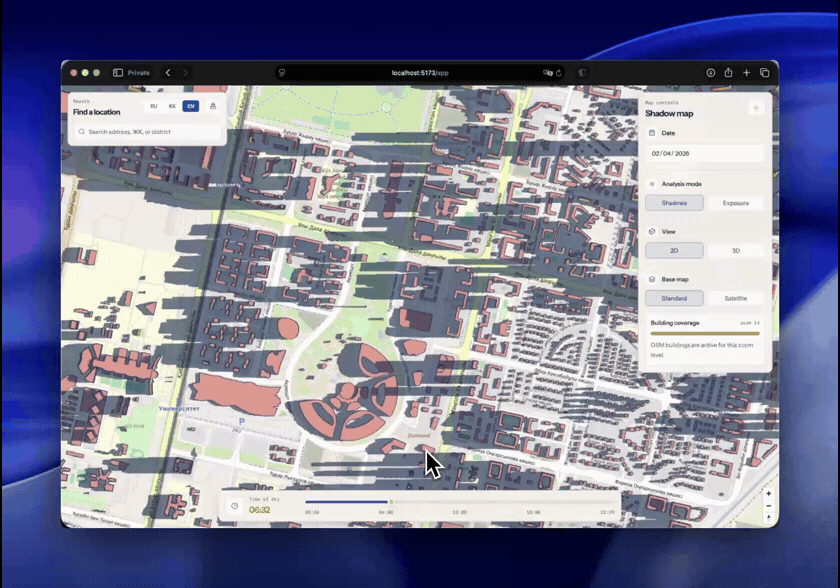

# Kolenke

AI decision-support platform for urban heat adaptation.

Kolenke turns open satellite and map data into ranked, explainable action plans for:
- urban greening,
- solar deployment,
- worker heat safety.

## Demo



## Why it exists
Cities are heating up, but city teams still lack operational tools that connect thermal evidence to concrete, local actions.

Kolenke is built to close that gap: not just “where it is hot”, but “where to act first”.

## Live product: 4 modes, one map
Kolenke is already running as a browser platform with four practical workflows:

1. Heat (LST) Layer
- Landsat-based heat layer over the city.
- Time-of-day visualization with real shadow simulation.

2. Tree Optimizer
- Draw an area, set canopy target, get ranked planting sites.
- Before/after cooling impact estimates and per-site AI explanation.

3. Solar Panel Ranker
- Drag a panel to any roof/yard point.
- Shadow-adjusted annual yield (kWh/yr) and CO2 offset estimates.

4. Heat Safety Planner
- Shift-level exposure simulation for outdoor crews.
- Rotation guidance to keep heat exposure within safer limits.

## Scientific rigor and transparency
Kolenke is designed to be auditable:
- explicit scoring formula (no black-box ranking),
- peer-reviewed coefficients for cooling and impact assumptions,
- reproducible inputs from open datasets,
- explainable recommendations per candidate point.

Core priority score concept:

`Priority = 0.55 * LST_norm + 0.35 * (1 - NDVI_norm) + 0.10 * exposure_norm`

## Indicative impact assumptions (from literature-backed model)
- Up to `-4°C` district air temperature reduction at higher canopy coverage scenarios.
- Around `21 kg CO2 / tree / year` sequestration reference estimate.
- About `1350+ kWh/m²/year` solar resource level for Astana latitude context.
- Cooling effects that can extend beyond the immediate intervention zone.

## Tech stack
- Frontend: React 19, TypeScript, Vite, MapLibre GL 5
- Shadow simulation: `mapbox-gl-shadow-simulator` (WebGL)
- Backend: FastAPI, Python 3.12
- Data and services: PostgreSQL, Redis, Supabase, RAGFlow, AlemLLM
- Geodata: OpenStreetMap (Overpass), Landsat 8/9, Sentinel-2
- Solar yield: PVGIS
- Infra: Docker + Docker Compose

## Quick start

```bash
make app-up        # postgres + backend (Docker)
make dev-frontend  # frontend on http://localhost:5173
```

Create `frontend/.env`:

```env
VITE_SHADEMAP_API_KEY=<your shademap.app key>
VITE_BACKEND_URL=http://localhost:8003
```

## Backend API

| Method | Path | Description |
|---|---|---|
| POST | `/ml/tree-optimizer/rank` | Rank tree planting candidates |
| POST | `/ml/tree-optimizer/explain` | Explain candidate with AI |
| POST | `/ml/solar-optimizer/rank` | Rank solar panel candidates |
| POST | `/ml/best-side/predict` | Predict best facade side by insolation |
| POST | `/ml-data/geocoding/search` | Geocoding |
| POST | `/ml-data/overpass/buildings` | Building footprints from OSM |
| POST | `/alemllm/chat` | Chat assistant |
| GET | `/health` | Service health |

## Roadmap
1. Municipal integrations (planning APIs, reporting, IoT overlays).
2. Regional rollout across Central Asia.
3. Multi-language and policy-ready planning exports.
4. Scalable global deployment where open satellite coverage exists.
